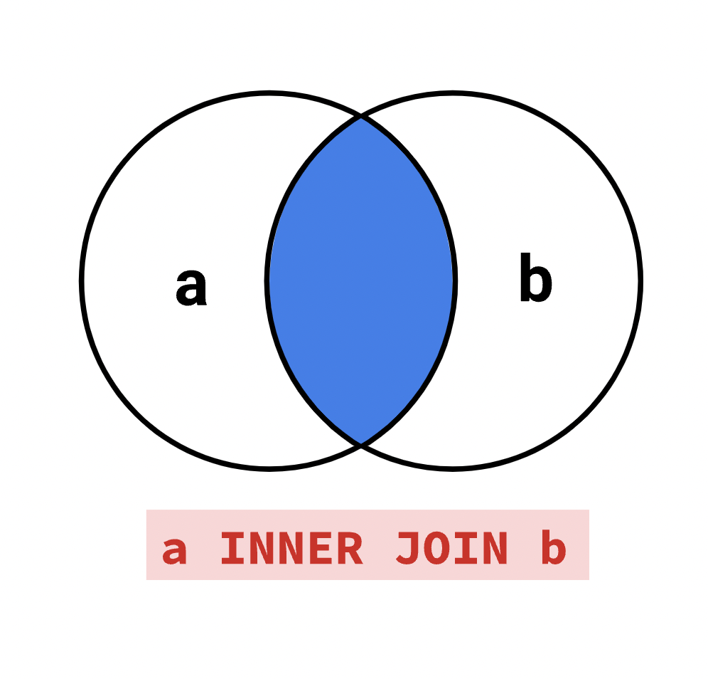
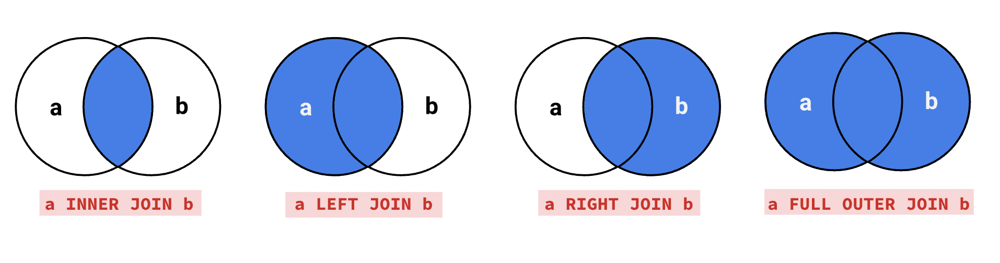

```{r setup, include=FALSE}
knitr::opts_chunk$set(echo = TRUE)
```

Talk about group project

# Lecture 11

A query is a request for information from a database. Note that SQL and MySQL are not the same, as the latter is a software extension that uses SQL.

In R, the basic approach to a database is:

  - Connect to db: con <- dbConnect(SQL choice, 'database')
  - See the data sets inside: dbListTables(con)
  - Communicate through a qurey: dbGetQuery(con, 'qurey')

## 1. Syntax review

### 1.1. Aggregate function

```{r}
library(RSQLite)
setwd("~/Documents/ibs_course/BUS211/lecture11") # Set your path here
```
Note again you don't need to set up the path when you work with online dababase. See the example in DataCamp
```
con <- dbConnect(RMySQL::MySQL(), 
                 dbname = "tweater", 
                 host = "courses.csrrinzqubik.us-east-1.rds.amazonaws.com", 
                 port = 3306,
                 user = "student",
                 password = "datacamp")
```

Now consider the following question
```
What is the lowest proportion of women on the recent_grads table?
```
Recall that ShareWomen gives us the proportion of women graduates. 

One of way of thinking about this question is that we want to "determine the minimum value of ShareWomen" 

```{r}
con <- dbConnect(SQLite(), 'jobs.db')
dbListTables(con)
dbGetQuery(con, 'SELECT ShareWomen FROM recent_grads 
                 ORDER BY ShareWomen
                 LIMIT 3')
```
Looking at the sample above, we see that the three lowest ShareWomen values are roughly 0.09, 0.07 and 0, so the minimum is 0. Here's how we can use SQL to answer this question:

```
SELECT MIN(ShareWomen) 
  FROM recent_grads;
```
```{r echo=FALSE}
dbGetQuery(con, 'SELECT MIN(ShareWomen) 
                 FROM recent_grads')
```
It doesn't actually tell us what those majors are — we only know them because we singled out the three majors with fewer women than men. In a typical table, there are too many rows to find an answer just by looking.

#### A key idea in SQL is that every result is a table

This is a common visual representation that makes SQL approachable for more users. However, this means that users must convert datasets and calculations that aren't well suited for this representation in a SQL environment.
```{r}
class(dbGetQuery(con, 'SELECT MIN(ShareWomen) 
                       FROM recent_grads'))
```

In fact, MIN() is called an <b>aggregate function</b>. Aggregate functions apply over columns of values and return <b>a single value</b>. The MIN and MAX functions, for example, calculate and return the minimum and maximum values in a column.

Some other commonly used aggregate functions include the following:

- AVG — returns the mean of its input.
- COUNT — counts the number of values in its input.
- SUM — sums the values in its input.

Note the use of capital letters for the functions' names. This is <b>not necessary</b> to run the query, but it's a common convention that functions (just like other reserved words) should be uppercase. You should also use uppercase letters so the answer-checker can correctly validate your answer.

#### Exercise:
Write a query that computes the sum of the Total column.
```
Try to think about what qurey would return the following result.
```

```{r echo=FALSE}
Query <- 'SELECT SUM(Total) FROM recent_grads'
dbGetQuery(con, Query)
```

### 1.2. Query syntax

We learned how to return all majors with a majority of women:
```
SELECT Major
FROM recent_grads
WHERE ShareWomen > 0.5;
```
```{r echo=FALSE}
# Limit clause is used
dbGetQuery(con, 'SELECT Major
                  FROM recent_grads
                  WHERE ShareWomen > 0.5
                  LIMIT 4;')
```
Then, consider the question: How many majors included mostly women? We need an aggregate function:
```
What is the aggregate function we need to use here?
```
```{r echo=FALSE}
dbGetQuery(con,  'SELECT COUNT(Major)
                  FROM recent_grads
                  WHERE ShareWomen > 0.5')
```


#### Exercise: 
Write a query that returns the number of majors that include mostly men.
```
Try to think about what qurey would return the following result.
```
```{r echo=FALSE}
Query <- 'SELECT COUNT(Major) FROM recent_grads WHERE ShareWomen < 0.5'
dbGetQuery(con, Query)
```

We can select multiple columns by including their names with commas, like this:
```
SELECT Major, Major_category
FROM recent_grads
LIMIT 5;
```
```{r echo=FALSE}
Query <- 'SELECT Major, Major_category FROM recent_grads LIMIT 5;'
dbGetQuery(con, Query)
```

We can use the same principle to combine multiple aggregation functions into a single query:
```
SELECT MIN(Median), MAX(Median), SUM(Total)
FROM recent_grads;
```
```{r echo=FALSE}
dbGetQuery(con, 'SELECT MIN(Median), MAX(Median), SUM(Total)
FROM recent_grads;')
```

### 1.3. Alias
All of the queries we've written so far have had somewhat unpleasant column names in the results, like AVG(Total) and MIN(Men). Many companies use SQL environments and tools that can run your query, turn the results into a plot of your choosing, and then create a PDF report containing multiple plots (and some additional explanation from the user). Since others may interpret the results of your SQL queries, it's helpful to specify custom names for the columns in our results.

We can do this using AS:
```
SELECT SUM(Total) AS num_students
FROM recent_grads;
```
```{r echo=FALSE}
dbGetQuery(con, 'SELECT SUM(Total) AS num_students FROM recent_grads;')
```
If we use certain characters, like spaces, we need to surround the alias with quotes. We can specify an arbitrary phrase as a string using quotation marks:
```
SELECT SUM(Total) AS 'Total Students'
FROM recent_grads;
```
```{r echo=FALSE}
dbGetQuery(con, 'SELECT SUM(Total) AS "Total Students"  FROM recent_grads;')
```

```
The following qurey would not work in R. Why?
'SELECT SUM(Total) AS 'Total Students'  FROM recent_grads;'
```

We can drop AS entirely and just add the name next to the original column:
```
SELECT SUM(Total) 'Total Students'
FROM recent_grads;
```
```{r echo=FALSE}
dbGetQuery(con, 'SELECT SUM(Total) "Total Students" FROM recent_grads;')
```
Lastly, we can reference renamed columns when writing longer queries to make our code more compact:
```
SELECT Major AS m, Major_category AS mc, Unemployment_rate AS ur
FROM recent_grads
WHERE (mc = 'Engineering') AND (ur > 0.04 and ur < 0.08)
ORDER BY ur DESC
```
```{r echo=FALSE}
dbGetQuery(con, 'SELECT Major AS m, Major_category AS mc, Unemployment_rate AS ur
                  FROM recent_grads
                  WHERE (mc = "Engineering") AND (ur > 0.04 and ur < 0.08)
                  ORDER BY ur DESC')
```
#### Exercise:
Write a query that returns the following in this order:

- The number of rows as Number of Majors
- The maximum value of Unemployment_rate as Highest Unemployment Rate

```
Try to think about what qurey would return the following result.
```
```{r echo=FALSE}
Query <- "SELECT COUNT(*) as 'Number of Majors', MAX(Unemployment_rate) as 'Highest Unemployment Rate' FROM recent_grads"
dbGetQuery(con, Query)
```


### 1.4. Distinct statement
Major_category is a column with only a few unique values. What if we want to get a list with repetitions of the values in this column? Or what if we want to determine how many distinct values there are in this column?

We can return all of the unique values in a column using the DISTINCT statement.
```
SELECT DISTINCT Major_category
FROM recent_grads;
```
```{r echo=FALSE}
dbGetQuery(con, 'SELECT DISTINCT Major_category
FROM recent_grads;')
```

As with the other SQL clauses we've learned, we can use the DISTINCT statement with multiple columns to return unique pairings of those columns:

```
SELECT DISTINCT Major, Major_category
FROM recent_grads
LIMIT 5;
```
```{r echo=FALSE}
dbGetQuery(con, 'SELECT DISTINCT Major, Major_category
FROM recent_grads
LIMIT 5;')
```
Lastly, we can count the number of unique values in a column by nesting the COUNT() function with the DISTINCT clause:
```
SELECT COUNT(DISTINCT Major_category) AS unique_major_categories
FROM recent_grads;
```
```{r echo=FALSE}
dbGetQuery(con, 'SELECT COUNT(DISTINCT Major_category) AS unique_major_categories
FROM recent_grads;')
```

#### Exercise:
Write a query that returns the number of unique values in the Major, Major_category, and Major_code columns. Use the following aliases in this order:

- For the unique value count of the Major column, use the alias unique_majors.
- For the unique value count of the Major_category column, use the alias unique_major_categories.
- For the unique value count of the Major_code column, use the alias unique_major_codes.

```
Try to think about what qurey would return the following result.
```
```{r echo=FALSE}
Query <- "SELECT COUNT(DISTINCT Major) AS unique_majors,
       COUNT(DISTINCT Major_category) AS unique_major_categories,
       COUNT(DISTINCT Major_code) AS unique_major_codes
       FROM recent_grads;"
dbGetQuery(con, Query)
```


### 1.5. Column result

Aggregate functions take a column as input and return one value for the column. Now, we'll learn about functions that, when we pass them a column as input, return (a transformation of the input) <b>another column</b>. The values of text columns are typically called strings.

We'll start with the LENGTH function. Given a text column, the LENGTH function returns the number of characters in the input strings

```
SELECT Major,
       Total, Men, Women, Unemployment_rate,
       LENGTH(Major) AS Length_of_name
FROM recent_grads
ORDER BY Unemployment_rate DESC
LIMIT 3;
```
```{r echo=FALSE}
dbGetQuery(con, 'SELECT Major,
       Total, Men, Women, Unemployment_rate,
       LENGTH(Major) AS Length_of_name
FROM recent_grads
ORDER BY Unemployment_rate DESC
LIMIT 3;')
```

We can also concatenate strings by using the || operator. Here's an example:
```
SELECT "Dr." || "Moon" as "Angel";
```
```{r echo=FALSE}
dbGetQuery(con, 'SELECT "Dr." || "Moon" as "Angel";')
```

In the same way that we can compare columns with both constant numbers and other columns in WHERE clauses, we can also mix columns and constant strings when concatenating. For example:
```
SELECT 'Cat: ' || Major_category
FROM recent_grads
LIMIT 10;
```
```{r echo=FALSE}
dbGetQuery(con, 'SELECT "Cat: " || Major_category
FROM recent_grads
LIMIT 10;')
```

#### Exercise:
Write a query that does the following:

1. Selects in order
    - The values in the Major column in lowercase, preceded by the string 'Major: '. Use the alias Major.
    - Total
    - Men
    - Women
    - Unemployment_rate.
    - LENGTH(Major) as Length_of_name.
2. Orders in descending order by the unemployment rate.


```
Try to think about what qurey would return the following result.
```
```{r echo=FALSE}
Query <- "SELECT 'Major: ' || LOWER(Major) AS Major,
       Total, Men, Women, Unemployment_rate,
       LENGTH(Major) AS Length_of_name
        FROM recent_grads
      ORDER BY Unemployment_rate DESC
      LIMIT 10;"
dbGetQuery(con, Query)
```


### 1.6. Answer the question
Which majors had the largest spread (difference) between the 25th and 75th percentile starting salaries?

In the same way that we can use string functions and operators, we can also perform arithmetic on the columns in a table. SQL supports the standard arithmetic operators: *, +, -, and /, and we can use them like any other operator:

```{r}
dbGetQuery(con, 'PRAGMA table_info(recent_grads);')
```

```
SELECT P75th - P25th AS quartile_spread
FROM recent_grads
LIMIT 10;
```

```{r echo=FALSE}
dbGetQuery(con, 'SELECT P75th - P25th AS quartile_spread
FROM recent_grads
LIMIT 10;')
```

You can also add, subtract, multiply, or divide columns by individual values:
```
SELECT ShareWomen * 100 percent_female 
FROM recent_grads 
LIMIT 10;
```
```{r echo=FALSE}
dbGetQuery(con, 'SELECT ShareWomen * 100 percent_female 
FROM recent_grads 
LIMIT 10;')
```

One thing to note is that multiplying or dividing columns with a floating point value (or a column with floating point values) will result in floating point values:

- Two floats — returns a float.
    - SELECT 100.0 / 100.0 returns 1.0.
- A float and an integer — returns a float
    - SELECT 100 / 1.0 returns 100.0.
- Two integers — returns an integer
    - SELECT 100 / 10 returns 10
    
### Exercise:
Write a query that computes the difference between the 25th and 75th percentiles of salaries for all majors.

- Return the Major column first, using the default column name.
- Return the Major_category column second, using the default column name.
- Return the compute difference between the 25th and 75th percentiles third, using the alias quartile_spread.
- Order the results from lowest to highest and only return the first 20 results.

```
Try to think about what qurey would return the following result.
```
```{r echo=FALSE}
dbGetQuery(con, 'SELECT Major, Major_category, (P75th - P25th) AS quartile_spread
FROM recent_grads
ORDER BY quartile_spread
LIMIT 10;')
```

## 2. Joining data

Often, we'll have multiple tables in one database that are related in some way. The table we will work with was called facts, and each row represented a country from the Factbook.
```{r}
con <- dbConnect(SQLite(), 'factbook.db')
dbListTables(con)
```
```{r}
dbGetQuery(con, 'SELECT * FROM facts LIMIT 5')
```
In addition to the facts, we'll also be working with another table called cities which contains information on major urban areas from countries in the Factbook. These are the first five rows of the cities table.
```{r}
dbGetQuery(con, 'SELECT * FROM cities LIMIT 5')
```

- id: Unique ID for each city.
- name: Name of the city.
- population: Population of the city.
- capital: Whether the city is a capital city; 1 if it is, 0 if it isn't.
- facts_id: ID of the country, from the facts table.

In order to combine information from two different tables, we assume that there is some piece of information that is shared between them. Here, we can see that the facts_id column in cities is what connects us to a particular country ID in facts.

Now that we know how these two tables are related, we can start tuning our queries to combine data from both of them. When we combine two datasets in SQL, we say that we <b>join</b> them. The easiest way to join data using SQL is with an <b>inner join</b>. The syntax for an inner join is:
```
SELECT [column_names] FROM [table_name_one]
INNER JOIN [table_name_two] ON [join_constraint];
```
The result doesn't read clearly into plain English, but there are two clauses at work here. The first is the SELECT clause, which you should be familiar with. The second, the JOIN clause, is made up of two parts:

- The INNER JOIN statement tells the SQL engine the name of the table you wish to join into your query and that you wish to use an inner join.
- The ON statement, which tells the SQL engine what columns to use to join specific rows together.

Joins are usually used in a query after the FROM clause. The query below is a basic inner join where we combine the data from both of our facts and cities tables.

```
SELECT * FROM facts
INNER JOIN cities ON cities.facts_id = facts.id
LIMIT 5;
```
```{r echo=FALSE}
dbGetQuery(con, 'SELECT * FROM facts
INNER JOIN cities ON cities.facts_id = facts.id
LIMIT 5;')
```

```{r echo=T}
dbGetQuery(con, 
        'SELECT cities.facts_id, facts.id FROM facts
         INNER JOIN cities ON cities.facts_id = facts.id
         LIMIT 5;')
```

The column cities is denoted after INNER JOIN to indicate that this is the table from which we want to join. The condition, ON cities.facts_id = facts.id, describes which columns in either table to match to each other. In order to distinguish between which columns are used in which tables, we use the following syntax: table_name.column_name.

Something to keep in mind here is that the SELECT * will act slightly differently from what you are used to. Instead of just grabbing all the columns from facts, it will also give all the columns in cities since we are joining from it. 

This query gives us all columns from both tables and every row where there is a match between the id column from facts and the facts_id from cities.

#### Exercise:
Write a query that returns all columns from the facts and cities tables.

1. Use an INNER JOIN to join the cities table to the facts table.
2. Join the tables on the values where facts.id and cities.facts_id are equal.
3. Limit the query to the first 10 rows.
```
Try to think about what qurey would return the following result.
```
```{r echo=FALSE}
dbGetQuery(con, 'SELECT * FROM facts
INNER JOIN cities ON cities.facts_id = facts.id
LIMIT 10;')
```


### 2.1 Inner join I
An inner join only includes rows from both tables that have a match as specified by the ON clause. If we were to think about the collection of all IDs from facts.id and from cities.facts_id, an inner join works by selecting all of the rows from facts where an ID was in <b>both</b> facts.id and cities.facts_id. This is easily represented as a Venn diagram:

  

We learned how to use aliases to specify custom names for columns:
```
SELECT AVG(population) AS AVERAGE_POPULATION
```
We can also create aliases for table names to make queries with joins easier to both read and write. Our query from the last screen can be rewritten as:
```
SELECT * FROM facts AS f
INNER JOIN cities AS c ON c.facts_id = f.id
```
```{r echo=FALSE}
dbGetQuery(con, 'SELECT * FROM facts AS f
INNER JOIN cities AS c ON c.facts_id = f.id LIMIT 5;')
```

Our aliases can actually be combined with wildcards. If we wanted to select all of the columns from cities in the SELECT portion, we would write c.*. Doing so allows us to be able to be more explicit in our queries.

#### Exercise:
Write a query that:

1. Joins cities to facts using an INNER JOIN.
2. Uses aliases for table names.
3. Includes, in order:
  - All columns from cities.
  - The name column from facts aliased to country_name.
4. Includes only the first 5 rows.

```
SELECT c.*, f.name country_name FROM facts f
INNER JOIN cities c ON c.facts_id = f.id
LIMIT 5;
```
```{r echo=FALSE}
dbGetQuery(con, 'SELECT c.*, f.name country_name FROM facts f
INNER JOIN cities c ON c.facts_id = f.id
LIMIT 5;')
```


### 2.1 Inner join II
```{r}
dbGetQuery(con, 'SELECT * FROM facts LIMIT 5;')
dbGetQuery(con, 'SELECT * FROM cities LIMIT 5;')
```
Let's try answering another question with inner joins. The facts table contains countries, while cities contains some of these countries' capitals. Using inner joins, we can create a query to return a result that matches each capital to its respective country. Both contries and capitals are contained in the name column in their respective tables, so we'll SELECT them. 

Now that we know what we want, we just need to join them. The tables are still linked in the same way, so we can use the same inner join with these columns to join the data:
```
SELECT f.name, c.name FROM cities c
INNER JOIN facts f ON f.id = c.facts_id
```
```{r echo=F}
dbGetQuery(con, 'SELECT f.name, c.name FROM cities c
INNER JOIN facts f ON f.id = c.facts_id LIMIT 5;')
```
We're not completely done, though. We're only interested in capital cities, so we'll need a WHERE clause to properly filter the data. In the cities table, the capital column is binary: 1 if the city is a capital city and 0 otherwise. This seems like it'd be the perfect candidate to allow us to finish our query:
```
WHERE c.capital = 1
```
We can now put this all together to write a query that answers our question.

#### Exercise:
1. Write a query that returns, in order:
  - A column of country names, called country.
  - A column of each country's capital city, called capital_city.
2. Use an INNER JOIN to join the two tables in your query.
```
SELECT f.name country, c.name capital_city FROM cities c
INNER JOIN facts f ON f.id = c.facts_id
WHERE c.capital = 1
```
```{r echo=F}
dbGetQuery(con, 'SELECT f.name country, c.name capital_city FROM cities c
INNER JOIN facts f ON f.id = c.facts_id
WHERE c.capital = 1 LIMIT 5')
```

### 2.2 Left Join
An inner join excludes any rows where there is not a mutual match from both tables. We can confirm this with some simple SQL queries:
```
SELECT COUNT(DISTINCT(name)) FROM facts;
```
```{r echo=F}
dbGetQuery(con, 'SELECT COUNT(DISTINCT(name)) FROM facts;')
```
```
SELECT COUNT(DISTINCT(facts_id)) FROM cities;
```
```{r echo=F}
dbGetQuery(con, 'SELECT COUNT(DISTINCT(facts_id)) FROM cities;')
```
These results confirm that some countries in the facts table don't have corresponding rows in the cities table. Missing data should always be a point of investigation for data scientists. If we wanted to look at the cities in facts that don't have matching cities, we would need a different type of join to look at them — the <b>left join</b>.

In addition to the rows with matches that an inner join will select, a left join will also include rows from the first (or left) table that don't have a match.

  

Let's look at an example by replacing INNER JOIN with LEFT JOIN from the first query we wrote. We've also visualized this result below, and it's easy to see the difference that the left join creates.

```
SELECT * FROM facts
LEFT JOIN cities ON cities.facts_id = facts.id
```
```{r echo=F}
dbGetQuery(con, 'SELECT * FROM facts
LEFT JOIN cities ON cities.facts_id = facts.id LIMIT 5;')
```

For rows in facts that don't have a matching fact_id in cities, SQL populates these empty spaces with null values.

These null values can be used to filter our results in convenient ways. If we wanted to get back to our inner join result, we could add in a WHERE clause to exclude rows where any of the data from the cities table is NULL.
```
WHERE column_name_in_cities IS NOT NULL
```
Notice that instead of using = to see if a value was NULL, we need the keyword IS. Likewise, filtering for rows where the cities data was NULL will allow us to look at the data that didn't match.
```
WHERE column_name_in_cities IS NULL
```
Let's use a left join to explore the countries that don't exist in the cities table.

#### Exercise:
Write a query that returns the countries that don't exist in cities.

1. Your query should return two columns:
  - The country names, with the alias country.
  - The country population.
2. Use a LEFT JOIN to join cities to facts.
3. Include only the countries from facts that don't have a corresponding value in cities.

```
SELECT f.name country, f.population
FROM facts f
LEFT JOIN cities c ON c.facts_id = f.id
WHERE c.name IS NULL;
```
```{r echo=F}
dbGetQuery(con, 'SELECT f.name country, f.population
FROM facts f
LEFT JOIN cities c ON c.facts_id = f.id
WHERE c.name IS NULL
LIMIT 20;')
```


### 2.3 Uncommon Join
There are a number of different reasons why countries may not have corresponding values in cities:

- Some countries have small populations and/or no major urban areas (defined as having populations of over 750,000), e.g. San Marino, Kosovo, and Nauru.
- Some rows are city-states, such as Monaco and Singapore.
- Some rows are territories that are not themselves countries, such as Hong Kong, Gibraltar, and the Cook Islands.

There are two other types of joins that you should be aware of. <b>SQLite does not support these types of joins</b>, so unfortunately you won't be able to practice them, but they are still important to know nonetheless.

The first is a right join. A right join performs the opposite operation of a left join, and it will include all the rows of the inner join in addition to rows in cities that did not have a match.

Right joins are mainly used when you are joining more than two tables. In these cases, using a right join is preferable because it can avoid restructuring your whole query to join one table. Outside of this context, right joins are rarely used. In most cases, left and inner joins will perform the task well enough.

The other join type not supported by SQLite is a full outer join. You can think of a full outer join as a combination of both a left and right join. Not only will we get rows with matched IDs, we'll get the unmatched data from both facts and cities.

Like right joins, full outer joins are reasonably uncommon. Similar results can be achieved using a union clause. The standard SQL syntax for a full outer join is:

```
SELECT f.name country, c.name city
FROM cities c
FULL OUTER JOIN facts f ON f.id = c.facts_id
LIMIT 5;
```
```{r echo=F}
dbGetQuery(con, 'SELECT f.name country, c.name city
FROM cities c
FULL OUTER JOIN facts f ON f.id = c.facts_id
LIMIT 30;')
```

### 2.4 Application
Let's use what we've learned to produce a list of the top 10 capital cities by population. Remember that capital is a boolean column containing 1 or 0, depending on whether a city is a capital or not. We want the most populated capital cities, so you'll also need to sort the results with ORDER BY.

Before we dive into the query, you can apply a useful shortcut to shorten your code. Previously, we used column names to specifying how the query results should be ordered, like so:
```
SELECT name, migration_rate FROM FACTS
ORDER BY migration_rate DESC;
```
```{r echo=F}
dbGetQuery(con, 'SELECT name, migration_rate FROM FACTS
ORDER BY migration_rate DESC LIMIT 5;')
```

Instead of using the column name migration_rate, we could have also indicated a number to reflect a column in the SELECT clause. For example, migration_rate is the second column specified, so we can write 2 in the ORDER BY clause instead, and it will still have the same effect:
```
SELECT name, migration_rate FROM FACTS
ORDER BY 2 DESC;
```
```{r echo=F}
dbGetQuery(con, 'SELECT name, migration_rate FROM FACTS
ORDER BY 2 DESC LIMIT 5;')
```

This shortcut can be used in either the ORDER BY or GROUP BY clauses. However, in taking shortcuts, you should always be mindful of the readability of your queries. Brevity is great in the moment, but if we can't read our queries in the future, it loses its utility.

We won't specify which join type you should use here. Take some time to think about the question and the query needed to answer it.
#### Exercise:
Write a query that returns the 10 capital cities with the highest population ranked from biggest to smallest population.

- Include the following columns, in order:

1. capital_city, the name of the city.
2. country, the name of the country the city is from.
3. population, the population of the city.
```
SELECT c.name capital_city, f.name country, c.population
FROM facts f
INNER JOIN cities c ON c.facts_id = f.id
WHERE c.capital = 1
ORDER BY 3 DESC
LIMIT 10;
```
```{r echo=F}
dbGetQuery(con, 'SELECT c.name capital_city, f.name country, c.population
FROM facts f
INNER JOIN cities c ON c.facts_id = f.id
WHERE c.capital = 1
ORDER BY 3 DESC
LIMIT 10;')
```