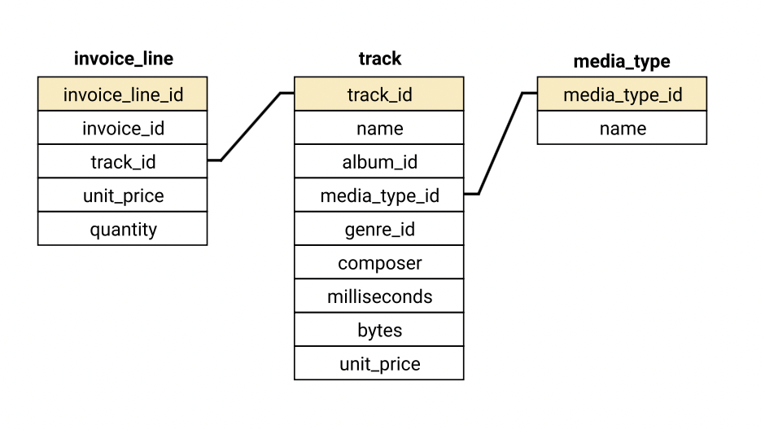
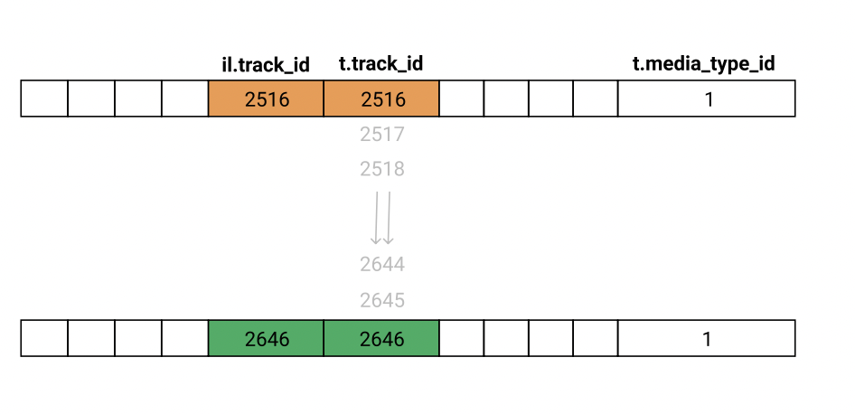
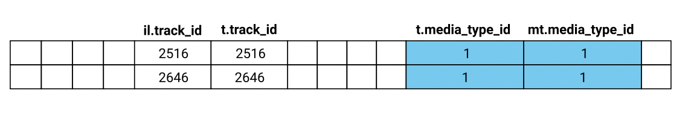
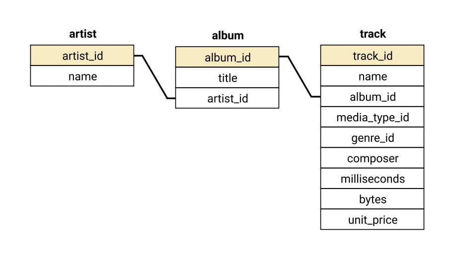

```{r setup, include=FALSE}
knitr::opts_chunk$set(echo = TRUE)
setwd("~/Documents/ibs_course/BUS211/lecture12")
library(RSQLite)
```

# More on Joining

we learned how to use joins to combine data from two tables within a database. In this lesson, we'll learn more tools to expand our capabilities to combine data from more than two tables at a time. Most databases you'll deal with in the workplace have much more than two tables.

We'll work with a modified version of a database called Chinook. 

The Chinook database contains information about various elements in a fictional digital music shop, such as artists, songs, and albums, as well as the shop's employees, customers, and the customers' purchases. All this information is contained in 11 tables.

```{r}
con <- dbConnect(SQLite(), 'chinook.db')
dbListTables(con)
```

First, we'll gather some information on specific purchases. For a single purchase (denoted by invoice_id), we want to assemble the following information together:

- The ID of the track.
- The name of the track.
- The name of media type of the track.
- The price that the customer paid for the track.
- The quantity of the track that was purchased.

This information is scattered among three tables: <b>invoice_line</b>, <b>track</b>, and <b>media_type</b>. To make this easier to see, an abbreviated schema diagram of just these three tables is shown below:
  

We can look at the syntax for joining data from more than two tables.

```
SELECT [column_names] FROM [table_name_one]
[join_type] JOIN [table_name_two] ON [join_constraint]
[join_type] JOIN [table_name_three] ON [join_constraint];
```

If the syntax looks familiar, it should! Joining multiple tables together simply amounts to adding multiple JOIN clauses onto your query. Joins are interpreted in the order they are written, so the first join will be executed, and then the second join will be executed against the result of the first join. Thanks to how joins are read, we can first build our query incrementally to ensure our results are as expected.

We will use the invoice_line table in our FROM clause since it contains 3 of the 5 columns we want in our final query. Of course, you can start with either of the other two, but just having most of the columns we need already cuts down on the work.

Since our tasks involves looking for information about a specific invoice_id, let's choose an invoice_id value of 3. Selecting all lines from invoice_line with an invoice_id is straightforward:
```
SELECT * FROM invoice_line
WHERE invoice_id = 3;
```
```{r echo=F}
dbGetQuery(con, 'SELECT * FROM invoice_line
WHERE invoice_id = 3;')
```

Now we can use an inner join to add the data from the track table.
```
SELECT * FROM invoice_line il
INNER JOIN track t ON t.track_id = il.track_id
WHERE invoice_id = 3;
```
```{r echo=F}
dbGetQuery(con, 'SELECT * FROM invoice_line il
INNER JOIN track t ON t.track_id = il.track_id
WHERE invoice_id = 3;')
```



Next, we add our second join to add the data from the media_type table.
```
SELECT * FROM invoice_line il
INNER JOIN track t ON t.track_id = il.track_id
INNER JOIN media_type mt ON mt.media_type_id = t.media_type_id
WHERE invoice_id = 3;
```
```{r echo=F}
dbGetQuery(con, 'SELECT * FROM invoice_line il
INNER JOIN track t ON t.track_id = il.track_id
INNER JOIN media_type mt ON mt.media_type_id = t.media_type_id
WHERE invoice_id = 3;')
```



Our query has a lot of columns we don't need, so we need to alter the SELECT clause to include only the columns we require.

Interpret the following:
```
SELECT
    il.track_id,
    t.name track_name,
    mt.name track_type,
    il.unit_price,
    il.quantity
FROM invoice_line il
INNER JOIN track t ON t.track_id = il.track_id
INNER JOIN media_type mt ON mt.media_type_id = t.media_type_id
WHERE il.invoice_id = 4;
```
```{r echo=F}
dbGetQuery(con, 'SELECT
    il.track_id,
    t.name track_name,
    mt.name track_type,
    il.unit_price,
    il.quantity
FROM invoice_line il
INNER JOIN track t ON t.track_id = il.track_id
INNER JOIN media_type mt ON mt.media_type_id = t.media_type_id
WHERE il.invoice_id = 4;
')
```


Let's extend the query we wrote in the previous screen by adding the artist for each track. If you examine the schema, you'll see that the data for the artist's name is not directly connected to the track table — it is connected through album as an intermediary.



To add in artists, we'll need to join two new tables to our existing query:

 - album, which has a column common to each of the artist and track tables, which allows us to join those two tables.
 - artist, which contains the artist name data that we need.
 
Our SELECT clause won't actually use any of the columns from the album table. When wrtiting complex queries, it's quite common to need to join a specific table because it will let you join to another table.

Interpret the followng q:

```
SELECT
    il.track_id,
    t.name track_name,
    ar.name artist_name,
    mt.name track_type,
    il.unit_price,
    il.quantity
FROM invoice_line il
INNER JOIN track t ON t.track_id = il.track_id
INNER JOIN media_type mt ON mt.media_type_id = t.media_type_id
INNER JOIN album al ON al.album_id = t.album_id
INNER JOIN artist ar on ar.artist_id = al.artist_id
WHERE il.invoice_id = 4;
```

```{r echo=F}
dbGetQuery(con, 'SELECT
    il.track_id,
    t.name track_name,
    ar.name artist_name,
    mt.name track_type,
    il.unit_price,
    il.quantity
FROM invoice_line il
INNER JOIN track t ON t.track_id = il.track_id
INNER JOIN media_type mt ON mt.media_type_id = t.media_type_id
INNER JOIN album al ON al.album_id = t.album_id
INNER JOIN artist ar on ar.artist_id = al.artist_id
WHERE il.invoice_id = 4;
')
```

We are also able to join on tables created by subqueries. Let's demonstrate this with a query that allows us to see which artists have the most purchases in our virtual store.

The invoice_line table contains information on customer purchases and the tracks they purchased. After linking these song purchases to their respective artist, we can calculate popularity using a GROUP BY clause.

With any complex query, we should first start by thinking about which tables contain our data and which columns we need. The data we need is in 4 separate tables: <b>invoice_line, track, album and artist.</b>

We could perform our query using multiple chained joins, but it could be simpler if we had a single table containing both the track ID (track.track_id) and the associated artist (artist.name). From there, we can just join the result of our subquery to invoice_line. This means our process will be:

- Write a subquery that produces a table with both track.track_id and artist.name,
- Join that subquery to the invoice_line table,
- Use a GROUP BY statement to calculate the number of times each artist has had a track purchased, and find the top 10.

We can write our subquery by joining album to track and then artist to album, just like we did in the previous screen. For presentational purposes, we'll add an ORDER BY and LIMIT to our subquery, but we won't need it in the final product.

```
SELECT
    t.track_id,
    ar.name artist_name
FROM track t
INNER JOIN album al ON al.album_id = t.album_id
INNER JOIN artist ar ON ar.artist_id = al.artist_id
ORDER BY 1 LIMIT 5;
```
```{r echo=F}
dbGetQuery(con, 'SELECT
    t.track_id,
    ar.name artist_name
FROM track t
INNER JOIN album al ON al.album_id = t.album_id
INNER JOIN artist ar ON ar.artist_id = al.artist_id
ORDER BY 1 LIMIT 5;
')
```

Now we need to join this subquery to the invoice_line table. We'll give our subquery an alias ta for 'track artist' to make it easier to refer to. Again, we'll add an ORDER BY and LIMIT statement so our output is more manageable.

```
SELECT
    il.invoice_line_id,
    il.track_id,
    ta.artist_name
FROM invoice_line il
INNER JOIN (
            SELECT
                t.track_id,
                ar.name artist_name
            FROM track t
            INNER JOIN album al ON al.album_id = t.album_id
            INNER JOIN artist ar ON ar.artist_id = al.artist_id
           ) ta
           ON ta.track_id = il.track_id
ORDER BY 1 LIMIT 5;
```
```{r echo=F}
dbGetQuery(con, 'SELECT
    il.invoice_line_id,
    il.track_id,
    ta.artist_name
FROM invoice_line il
INNER JOIN (
            SELECT
                t.track_id,
                ar.name artist_name
            FROM track t
            INNER JOIN album al ON al.album_id = t.album_id
            INNER JOIN artist ar ON ar.artist_id = al.artist_id
           ) ta
           ON ta.track_id = il.track_id
ORDER BY 1 LIMIT 5;
')
```

We only see Guns N' Roses here because the first order was for multiple songs from this group. All that remains is for us to add our GROUP BY clause, remove the extra columns, and use ORDER BY and LIMIT clauses to select the 10 most popular artists.

```
SELECT
    ta.artist_name artist,
    COUNT(*) tracks_purchased
FROM invoice_line il
INNER JOIN (
            SELECT
                t.track_id,
                ar.name artist_name
            FROM track t
            INNER JOIN album al ON al.album_id = t.album_id
            INNER JOIN artist ar ON ar.artist_id = al.artist_id
           ) ta
           ON ta.track_id = il.track_id
GROUP BY 1
ORDER BY 2 DESC LIMIT 10;
```
```{r echo=F}
dbGetQuery(con, 'SELECT
    ta.artist_name artist,
    COUNT(*) tracks_purchased
FROM invoice_line il
INNER JOIN (
            SELECT
                t.track_id,
                ar.name artist_name
            FROM track t
            INNER JOIN album al ON al.album_id = t.album_id
            INNER JOIN artist ar ON ar.artist_id = al.artist_id
           ) ta
           ON ta.track_id = il.track_id
GROUP BY 1
ORDER BY 2 DESC LIMIT 10;
')
```

You can use a similar technique to work out from which albums the most songs have been purchased.

#### Exercise
1. Write a query that returns the top 5 albums, as calculated by the number of times a track from that album has been purchased. Your query should return the following columns, in order:

- album, the title of the album
- artist, the artist who produced the album
- tracks_purchased the total number of tracks purchased from that album

2. Your query should list the albums from most tracks purchased to least tracks purchased.

```{r echo=F}
dbGetQuery(con, 'SELECT
    ta.album_title album,
    ta.artist_name artist,
    COUNT(*) tracks_purchased
FROM invoice_line il
INNER JOIN (
            SELECT
                t.track_id,
                al.title album_title,
                ar.name artist_name
            FROM track t
            INNER JOIN album al ON al.album_id = t.album_id
            INNER JOIN artist ar ON ar.artist_id = al.artist_id
           ) ta
           ON ta.track_id = il.track_id
GROUP BY 1, 2
ORDER BY 3 DESC LIMIT 5;
')
```

## R again

In homework 4, we used dataframe manipulation tools to remove data that we won't need for our analysis, to create new variables, and to change data types.

Here, we'll learn how to combine dataframes into one single, clean dataframe for further analysis.

Use again
```
sat_results
ap_2010
class_size
demographics
graduation
hs_directory
```
```{r, include = F}
library(tidyverse)
sat_results <- read_csv("sat_results_2.csv")
ap_2010 <- read_csv("ap_2010_2.csv") 
class_size <- read_csv("class_size_2.csv")
demographics <- read_csv("demographics_2.csv") 
graduation <- read_csv("graduation_2.csv") 
hs_directory <- read_csv("hs_directory_2.csv")
```

We learned to combine vectors and matrices by rows and columns using rbind() and cbind().

When we combined vectors and matrices, we bond values of rows or columns together by position. We learned that if vectors are of different lengths, the <b>recycling rule</b> dictates that the shorter vector is repeated.

We can combine dataframes by using the same ways with the functions <b>bind_rows()</b> and <b>bind_cols()</b>, which work similarly to rbind() and cbind().

In contrast, when we combine a pair of dataframes, we can bind columns together based on a variable's matching values rather than on observation positions. The variable used to connect each pair of tables is called a key. In this case, we will combine dataframes based on the key variable <b>DBN</b>.

To combine the dataframes, we'll use dplyr tools for working with multiple tables of data. When we have multiple tables containing data that we are interested in relationships between, they are collectively referred to as relational data.

The six dataframes we have been working with are considered relational data. This because we are interested in relationships between variables in different tables, such as SAT score and average class size.

We'll use the dplyr functions to combine the tables for performing mutating joins, which add new variables to one dataframe based on matching observations in another dataframe.


Before joining dataframe, for our analysis, we have to ensure that each dataframe has one observation - that is, one row - for each school. The DBN variable must be unique to each school. To successfully combine the dataframes, we should have no more than one instance of each DBN value per dataframe.

There are various ways we could check for duplicate values of DBN within each dataframe. However, we'll learn one that we find to be incredibly efficient, using the duplicated() function.

duplicated() is a base R function, so we don't need to load any new packages to use it. The function takes a vector as input and returns a logical vector that indicates whether the value is a duplicate of one that comes before it in the vector.

To illustrate how this works, let's create a vector with a duplicated value:
```{r}
vector <- c(1,2,3,4,5,5,6)
duplicated(vector)
```
Because the second instance of 5 in vector is in the sixth position, the sixth value of the duplicated() output is TRUE.

We could apply the duplicated() function to each dataframe's DBN column, for example:
```{r}
duplicated(sat_results$DBN)
sum(duplicated(vector))
```

#### Exercise:
In this exercise we will count the number of duplicated DBN values for each dataset. As a reminder, the datasets we will work with are:
```{r}
sum(duplicated(sat_results$DBN))
sum(duplicated(ap_2010$DBN))
sum(duplicated(class_size$DBN))
sum(duplicated(demographics$DBN))
sum(duplicated(graduation$DBN))
sum(duplicated(hs_directory$DBN))
```

Only ap_2010 has a duplicate DBN value.

To remove the duplicated rows from ap_2010 we can use the dplyr function distinct(). Its syntax is as follows:
```
dataframe %>%
    distinct(the_name_of_the_column, .keep_all = TRUE)
```
The <b>.keep_all = TRUE</b> parameter allows keeping all the columns in the dataframe.
```{r}
ap_2010 <- ap_2010 %>%
  distinct(DBN, .keep_all =  TRUE)
```

As we combine the six NYC schools dataframes, we will begin with one dataframe and then add variables from the other dataframes to it by matching them up with the values of DBN, the key. Recall that the term for joins that add new variables to a dataframe based on matching observations in another dataframe is <b>mutating joins</b>. There are two main types of mutating joins that we will discuss:

- Inner Joins
- Outer Joins

Let's start with inner joins, which match pairs of variables in two dataframes whenever their values of the key are the same. The resulting dataframe does not include any rows with unmatched keys.

Inner joins are useful when we only want to include results that appear in both of the tables we're joining. For example, suppose we're interested in using our data to make a scatter plot to understand the relationship between class size and how well students score on the SAT. In that case, our new dataframe probably doesn't need to include data on total SAT scores that doesn't have a matching class size value.

To combine two tables using an inner join, we can use the dplyr function inner_join(). The syntax involves beginning with one dataframe and specifying the dataframe we want to join with it. To specify the identity of the key you'll use for the join, use by = "DBN":
```{r}
sat_results %>%
  inner_join(class_size, by = "DBN") %>%

ggplot() +
      aes(x = avg_class_size, y = avg_sat_score) +
      geom_point()
```

Now that we've learned about using inner joins to combine dataframes, let's move on to discussing the other type of mutating join we'll be working with: Outer joins.

Outer joins keep observations that appear in at least one of the two tables we're combining. Outer joins can be divided into three types:

- Left joins
- Right joins
- Full joins

To illustrate how these different types of outer joins work, we'll once again use abbreviated versions of the sat_results and class_size dataframes as examples.

Performing a left join keeps all observations in the dataframe on the left (sat_results) and drops observations from the dataframe on the right (class_size) that have no key (DBN) match.

Performing a right join keeps all observations in the dataframe on the right (class_size) and drops observations from the dataframe on the left (sat_results) that have no key (DBN) match.

Performing a full join keeps all observations from both the sat_results and class_size dataframes, and fills in missing variables with "NA".

The syntax for combining dataframes using outer joins is similar to that which we used to perform inner joins. The dplyr functions to perform the different types of outer joins are:
```
left_join()
right_join()
full_join()
```
As with the inner_join() function, when using the three functions for performing outer joins, use by = "DBN" to specify the key's identity.
```{r}
sat_results %>%
  left_join(class_size, by = "DBN")
```

These three types of outer joins are useful under different circumstances, and which one we choose will depend on our data analysis needs.

For example, let's say we mainly are interested in how class size (avg_class_size in the class_size dataframe) and the percentage of a school's students learning English (ell_percent in the demographics dataframe) are related to scores on the writing portion of the SAT. When we combine the sat_score, class_size, and demographics dataframes, we may choose to join class_size and demographics to sat_score using left_join(), so we retain all class size and demographics data that match an SAT score.

We can use the %>% piping operator to chain multiple types of join functions together. To join class_size and demographics to sat_results as described above, we could write:

```{r}
combined <- sat_results %>%
  left_join(class_size, by = "DBN") %>%
  left_join(demographics, by = "DBN")
```

#### Exercise:
1. Join demographics to sat_results using left_join().
  - Save the resulting dataframe as demo_sat_left.
2. Join demographics to sat_results using right_join().
  - Save the resulting dataframe as demo_sat_right.
3. Join demographics to sat_results using full_join().
  - Save the resulting dataframe as demo_sat_full.
4. Compare the three new dataframes.
  - We can use the nrow() function to print out the sizes of the dataframes: sat_results, demographics, demo_sat_left, demo_sat_right, and demo_sat_full.
  - Then, we compare the sat_results and demographics sizes to demo_sat_left, demo_sat_right, and demo_sat_full sizes.
  - Now, let's think about when the different types of outer joins may be useful.

```
demo_sat_left <- sat_results %>%
  left_join(demographics, by = "DBN")

demo_sat_right <- sat_results %>%
  right_join(demographics, by = "DBN")

demo_sat_full <- sat_results %>%
  full_join(demographics, by = "DBN")
```

We've learned about the different types of joins that we can use to combine dataframes. It's now time to combine the six dataframes to create a single, clean one to use for analyses that we'll perform over the rest of this course.

As we decide which types of joins to use to combine the dataframes, let's briefly revisit our goal for this analysis: We will use the data to understand how NYC high schools' demographics (race, sex, income, etc.) affect how well students perform academically.

We'll start with the data that provides us with information about students' academic performance: sat_results and ap_2010. Some high schools may have data only for either SAT scores or AP exams. To make sure we retain all observations from these two dataframes, let's combine ap_2010 with sat_results using a full join.

Next, let's consider which type of join we should use to add the class_size, demographics, graduation, and hs_directory data to the new dataframe we're building. We want to retain all observations in sat_results and ap_2010. Thus, it makes sense to use left joins, so only values of the class_size, demographics, graduation, and hs_directory dataframes will be included in the new dataframe.

### Exercise:
Create a new dataframe, combined, containing data from the six separate dataframes we've been working with.

1. Use full_join() to join ap_2010 to sat_results.

2. Use left_join() to add class_size, demographics, graduation, and hs_directory to the new dataframe.

```{r echo = F}
combined <- sat_results %>%
  full_join(ap_2010, by = "DBN") %>%
  left_join(class_size, by = "DBN") %>%
  left_join(demographics, by = "DBN") %>%
  left_join(graduation, by = "DBN") %>%
  left_join(hs_directory, by = "DBN")
```